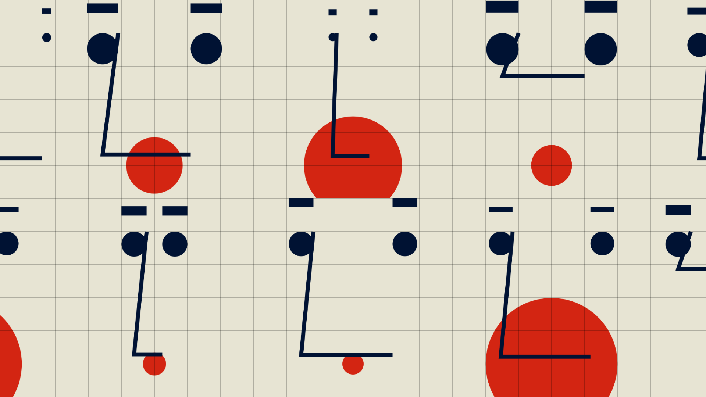

# How to create generative designs with genetic algorithms

Play God by learning how to create a basic genetic algorithm and making some
generative art.



Please meet oto and read the accompanying article on
[Algodeck](https://algodeck.com/how-to-create-generative-designs-with-genetic-algorithms/).

## How to run?

```bash
npm install
npm run dev
```

## Files

- The main genetic algorithm (GA) part is in [ga.js](ga.js)
- The setup of the GA and how to draw things is in [index.js](index.js)

Maybe try making a generative monster or a generative flower! Let me know if you
created any fun projects with the code.
